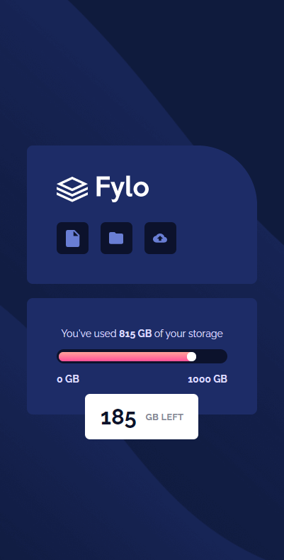

# Fylo-data-storage
It's a mockup of a Fylo Data Storage. 

# Technologies
In this project I used HTML, SCSS(SASS), JS.

[This is a challenge of FrontEnd Mentor](https://www.frontendmentor.io/challenges/fylo-data-storage-component-1dZPRbV5n).

## Result

> ### See the result live [here](https://fylo-data-storage-lusk1nha.vercel.app/)

Desktop Version -

Mobile Version -

